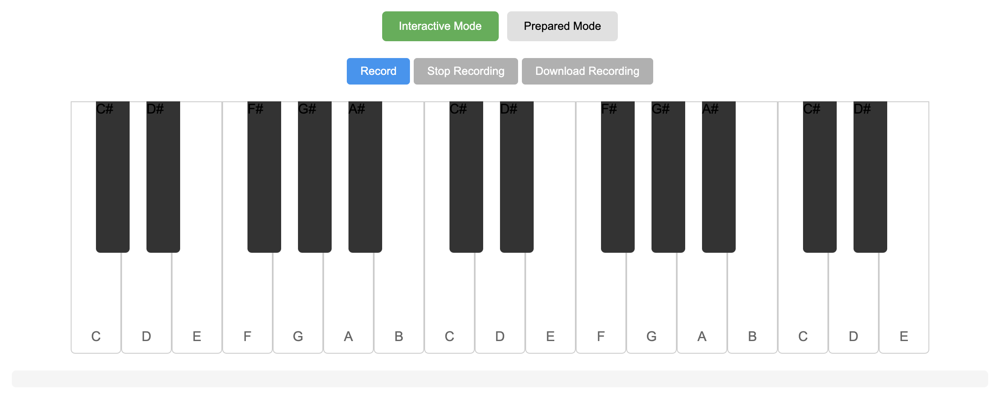
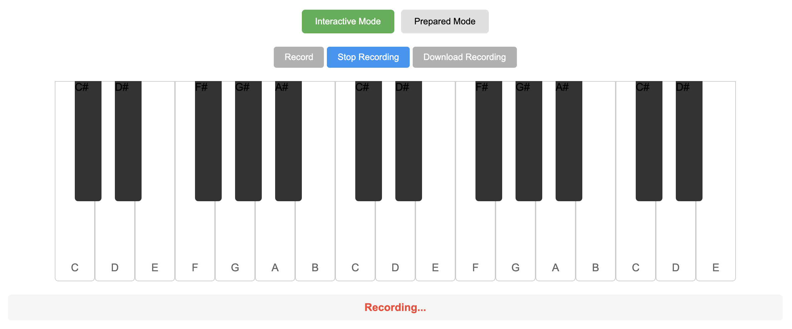

# pianoplayer

## Learning Objectives

- HTML/CSS
- Responsive Design & Media Queries
- DOM Manipulation
- Browser Events
- Audio API
- File System API
- JSON Data Handling
- State Management
- User Interface Design
- Keyboard Events

## Abstract

In this project, you will create an interactive web application called `pianoplayer` that:

- Provides a virtual piano interface
- Allows real-time playing using keyboard/mouse
- Records and saves piano performances
- Plays back pre-recorded songs
- Supports importing/exporting performances as JSON

## Context

> The web browser is not just a document viewer - it's a powerful application platform.
>
> — Tim Berners-Lee

Modern web browsers provide powerful APIs that enable rich interactive experiences. The Piano Player project combines these capabilities to create a musical instrument that can both be played in real-time and automated through pre-recorded sequences.

The project consists of two main modes:

1. Interactive Mode:

   - Virtual piano keyboard that responds to mouse clicks and keyboard input
   - Real-time sound generation using the Web Audio API
   - Recording functionality to capture key presses and timing
   - Export recordings as JSON files for later playback

2. Prepared Mode:
   - Load and play pre-recorded piano sequences from JSON files
   - Visual indication of upcoming key presses
   - Support for both user-recorded files and pre-made songs
   - Playback controls (play, pause, stop, speed adjustment)

## Resources

- [MDN Web Audio API Guide](https://developer.mozilla.org/en-US/docs/Web/API/Web_Audio_API)
- [Introduction to the File System Access API](https://web.dev/file-system-access/)
- [JavaScript Timing Events](https://www.w3schools.com/js/js_timing.asp)

## General Criteria

<!--
    Tip: general criteria here
    You MUST change this points to align with your project.
-->

- No external packages or CDN imports are allowed. If not, you will get `0` grade.
- Only vanilla `HTML`, `CSS`, and `JavaScript` are allowed. No external libraries or frameworks (e.g., `jQuery`, `React`) are permitted unless explicitly specified. If not, you will get `0` grade.
- The project MUST run without errors in the `console` on a modern browser.
- If the application crashes unexpectedly during the review, you will receive a `0`.
- `JavaScript` code must follow a standard [`ESLint rules`](https://eslint.org/docs/latest/use/getting-started) and the mandatory rules listed below:

```sh
{
  "semi": "error"
  "no-console": "error",
  "no-unused-vars": "error",
  "no-var": "error",
  "no-undef": "error"
}
```

- If any linter errors or warnings are presented, you will receive a `0`.
- Init or configure `package.json` to run the following command and apply the linter to all `.js` and `.ts`files:

```sh
$ npm run lint
```

## Mandatory Part

### Interactive Mode

The interactive mode allows users to play the piano in real-time.





**Requirements**

- Display a piano keyboard with at least 2 octaves (24 keys)
- Support both mouse clicks and keyboard input
- Highlight keys when pressed
- Generate accurate piano sounds for each key
- Provide a recording feature that captures:
  - Which keys were pressed
  - Precise timing of each key press and release
- Allow downloading recordings as JSON files
- Show visual feedback during recording

> Use the following keyboard mapping to link key with corresponding note:

| key | note and it's octave |     | key | note and it's octave |
| --- | -------------------- | --- | --- | -------------------- |
| q   | C3                   |     | 0   | D#4                  |
| 2   | C#3                  |     | p   | E4                   |
| w   | D3                   |     | z   | F4                   |
| 3   | D#3                  |     | s   | F#4                  |
| e   | E3                   |     | x   | G4                   |
| r   | F3                   |     | d   | G#4                  |
| 5   | F#3                  |     | c   | A4                   |
| t   | G3                   |     | f   | A#4                  |
| 6   | G#3                  |     | v   | B4                   |
| y   | A3                   |     | b   | C5                   |
| 7   | A#3                  |     | h   | C#5                  |
| u   | B3                   |     | n   | D5                   |
| i   | C4                   |     | j   | D#5                  |
| 9   | C#4                  |     | m   | E5                   |
| o   | D4                   |     |     |                      |

```json
// Example recording JSON format
{
  "name": "My Song",
  "duration": 12500,
  "notes": [
    {
      "key": "C4",
      "startTime": 0,
      "duration": 500
    },
    {
      "key": "E4",
      "startTime": 500,
      "duration": 1000
    }
  ]
}
```

### Prepared Mode

The prepared mode plays back pre-recorded sequences.


**Requirements**

- Accept JSON files in the specified format
- Provide play, pause, and stop controls
- Show a progress indicator during playback
- Highlight keys as they should be pressed
- Support adjustable playback speed
- Display upcoming notes visually
- Allow switching between different loaded songs

### Visual Design

The application must have a polished and professional appearance:

- Clear distinction between black and white keys
- Visible key press animations
- Responsive layout that works on different screen sizes
- Intuitive controls and indicators
- Clear mode switching interface

### Audio Requirements

- Generate piano sounds
- Support multiple simultaneous key presses
- Proper note release and decay
- No audio glitches or delays
- Speed control of record playback

## Support

Start by breaking down the project into smaller components:

1. First, create the visual piano keyboard
2. Add basic sound generation
3. Implement keyboard/mouse input
4. Add recording functionality
5. Implement the JSON export/import
6. Create the playback system
7. Add visual effects and polish

Test each component thoroughly before moving to the next. Use `console.log()` to debug timing and event issues. If you get stuck, try creating a minimal example that reproduces the problem.

## Author

This project has been created by:

Aidana Kalakova, Frontend Developer at Doodocs.kz

Contacts:

- Email: kalakova@doodocs.kz
- [GitHub](https://github.com/aidana-bk)
- [LinkedIn](https://www.linkedin.com/in/aidana-kalakova/)
